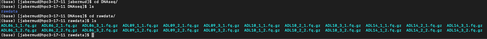

## HW6




#### I used professor Long's code for this assignment and as an exercise I decided to use online resources to parse the given source code and learn more about scripting in python.

** I am new to python and was not sure how a 'for' loop and 'if' statements could be applied with `os.symlink().`**

Citations:

- Code provided by Professor Long
- [os.symlink resource guide](https://www.geeksforgeeks.org/python-os-symlink-method/) helped introduce the os.symlink() syntax 
- Python for Biologist - a book resource that I am furiously trying to work through to help my literacy in python.
- [line.split](https://www.w3schools.com/python/ref_string_split.asp) - did not know that line split can do.

## Parsed code 
#### Annotated with what I learned searching online for help understanding the scripts.

## DNA Seq

```
# python
#import library
import os

#direct python to the files location
files=os.listdir("/data/class/ecoevo283/public/RAWDATA/DNAseq")

# use a for loop to iterate over "f" with "f" corresponding to each line containing a filename
# use an `if` conditional statement to select each compressed fastq filename
# use the `os.symlink` command by showing the filename and the corresponding destination and filename.

for f in files:
        if f.endswith('.fq.gz'):
                os.symlink("/data/class/ecoevo283/public/RAWDATA/DNAseq/"+f, "DNAseq/rawdata/"+f)
```

## RNA seq (provided code did not work for me)

error message:
 
```
(most recent call last):
  File "/data/class/ecoevo283/public/week6/RNAsymlink.py", line 21, in <module>
    for f in sys.stdin:
KeyboardInterrupt

```


```
#In unix, use regular expressions to make a file with all the fastq filenames
find /data/class/ecoevo283/public/RAWDATA/RNAseq/RNAseq384plex_flowcell01/ -name "*.fastq.gz" >fastqs.txt

# access the tab delimited file and use `cut` to extract the columns 1 and 12, which are the sample numbers and full sample name and name this file `dict.txt`
cat /data/class/ecoevo283/public/RAWDATA/RNAseq/RNAseq384_SampleCoding.txt | cut -f1,12 | tail -n +2 >dict.txt

# python
#import libraries with specfic attention to the 'regular expression' library
import os
import re
import sys

#create an open dataframe
#convert dict.txt from a tab delimited file into a `list` in python using line.split()
#define the key-value pairs in your dictionary
 
d = {}
with open("dict.txt") as FILEIN:
        for line in FILEIN:
                (key, val) = line.split()
                d[int(key)] = val

### Use regular expressions to make symlinks
for f in sys.stdin:
        f = f.strip('\n')
        if f.endswith('.fastq.gz') and "Undetermined" not in f:
                num=re.search("[0-9]+_",f).group(0).replace("_","")
                dir=re.search("_R[0-9]_",f).group(0).replace("_R1_","F").replace("_R2_","R")
                out="RNAseq/rawdata/"+ d[int(num)] + "_" + dir +".fq.gz"
                print(f,num,dir,out)
                os.symlink(f, out)

```

## ATAC-seq (provided code did not work for me)

error message:

```
(most recent call last):
  File "/data/class/ecoevo283/public/week6/ATACsymlink.py", line 7, in <module>
    os.symlink("/data/class/ecoevo283/public/RAWDATA/ATACseq/"+f, "ATACseq/rawdata/" + f2 + ".fq.gz")
FileNotFoundError: [Errno 2] No such file or directory: '/data/class/ecoevo283/public/RAWDATA/ATACseq/Sample_ACCAGCA-TATGCAGT_4R009_L1_P059_R2.fq.gz' -> 'ATACseq/rawdata/P059_R.fq.gz'

```

```
#import libraries
#use regular expressions to rename the files to include forward and reverse reads
#the difference to this assignment from DNA-seq is that we are making symlinks with non-identical names. 

import os
import re
files=os.listdir("/data/class/ecoevo283/public/RAWDATA/ATACseq")
for f in files:
        if f.endswith('.fq.gz'):
                f2=re.search("P[0-9]+_R[0-9]",f).group(0).replace("_R","_").replace("_1","_F").replace("_2","_R")
                os.symlink("/data/class/ecoevo283/public/RAWDATA/ATACseq/"+f, "ATACseq/rawdata/" + f2 + ".fq.gz")

```
